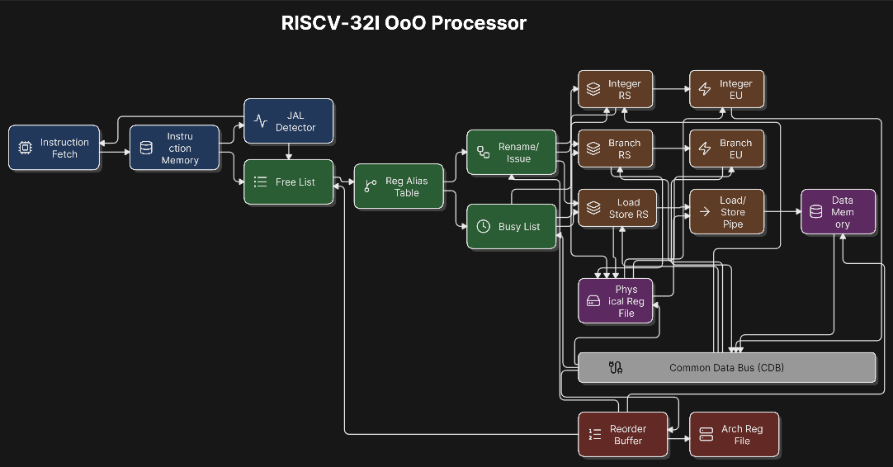
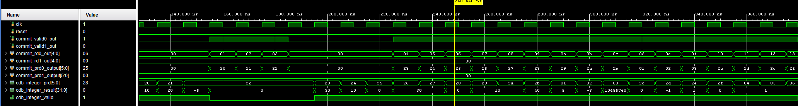

# 2-Wide Out-of-Order RISC-V (RV32I) Processor

A 2-wide Out-of-Order (OoO) processor designed in **SystemVerilog** implementing the **RV32I** instruction set. The processor supports register renaming, dynamic scheduling, out-of-order execution, and in-order retirement through a Reorder Buffer (ROB).

This project was developed to explore modern CPU microarchitecture concepts including instruction-level parallelism, hazard resolution, speculative execution infrastructure, and precise exception support.

---

## Features

- 2-wide superscalar instruction fetch and dispatch
- RV32I integer instruction support
- Register Alias Table (RAT)
- Physical Register File (PRF)
- Free List allocator
- Reservation Stations
- Common Data Bus (CDB)
- Integer Execution Unit
- Reorder Buffer (ROB)
- In-order commit
- Register renaming
- RAW hazard resolution
- Out-of-order execution
- Precise architectural state through ROB commit

---

## Processor Architecture

The processor follows a modern out-of-order execution pipeline.



### Pipeline Stages

1. **Instruction Fetch**
   - Fetches up to three RV32I instructions every cycle.

2. **Decode**
   - Decodes opcode, registers, immediates, and instruction type.

3. **Register Rename**
   - Maps architectural registers to physical registers using the RAT.
   - Allocates new physical destinations from the Free List.
   - Eliminates false WAR and WAW dependencies.

4. **Dispatch**
   - Inserts renamed instructions into Reservation Stations.
   - Allocates entries in the Reorder Buffer.

5. **Issue**
   - Instructions wake up when operands become available.
   - Independent instructions may issue out of program order.

6. **Execute**
   - Integer ALU performs arithmetic, logical, comparison, and shift operations.

7. **Writeback**
   - Results are broadcast on the Common Data Bus (CDB).
   - Waiting Reservation Station entries capture forwarded values.

8. **Commit**
   - Instructions retire in-order from the ROB.
   - Architectural Register File is updated only when instructions commit.

---

## Main Components

### Register Alias Table (RAT)

Maintains the mapping between architectural and physical registers.

---

### Physical Register File (PRF)

Stores speculative register values produced by executing instructions.

---

### Free List

Tracks available physical registers and allocates new destinations during dispatch.

---

### Reservation Stations

Buffer instructions waiting for operands.

Instructions may execute as soon as both operands become ready regardless of original program order.

---

### Integer Execution Unit

Supports all RV32I integer ALU operations including:

- ADD
- SUB
- AND
- OR
- XOR
- SLL
- SRL
- SRA
- SLT
- SLTU
- Immediate arithmetic
- Immediate logical operations
- Immediate shifts

---

### Common Data Bus (CDB)

Broadcasts execution results to:

- Reservation Stations
- Physical Register File
- Reorder Buffer

allowing dependent instructions to wake up immediately.

---

### Reorder Buffer (ROB)

Ensures precise architectural state by retiring instructions strictly in program order.

The ROB stores:

- destination register
- completion status
- physical destination register
- execution result

Only committed instructions update the Architectural Register File.

---

## Execution Example

The following waveform demonstrates instructions executing through the pipeline.



The waveform illustrates:

- multiple instructions executing simultaneously
- operand forwarding over the CDB
- register renaming
- reservation station wake-up
- out-of-order execution
- in-order retirement through the ROB

---

# Test Program

The processor was validated using the following RV32I instruction sequence.

| Instruction | Operation | Expected Result |
|-------------|-----------|----------------:|
| `addi x1, x0, 10` | x1 = 10 | **10** |
| `addi x2, x0, 20` | x2 = 20 | **20** |
| `addi x3, x0, -5` | x3 = -5 | **-5** |
| `add x4, x1, x2` | 10 + 20 | **30** |
| `sub x5, x2, x1` | 20 - 10 | **10** |
| `and x6, x1, x2` | 10 & 20 | **0** |
| `or x7, x1, x2` | 10 \| 20 | **30** |
| `xor x8, x1, x2` | 10 ^ 20 | **30** |
| `andi x9, x1, 0x0F` | 10 & 15 | **10** |
| `ori x10, x1, 0x0F` | 10 \| 15 | **15** |
| `xori x11, x1, 0x0F` | 10 ^ 15 | **5** |
| `slli x12, x1, 2` | 10 << 2 | **40** |
| `srli x13, x1, 1` | 10 >> 1 | **5** |
| `srai x14, x3, 1` | -5 >> 1 | **-3** |
| `sll x15, x1, x2` | 10 << 20 | **10485760** |
| `srl x16, x1, x2` | Logical shift | **0** |
| `sra x17, x3, x1` | Arithmetic shift | **-1** |
| `slt x18, x3, x1` | -5 < 10 | **1** |
| `sltu x19, x3, x1` | Unsigned compare | **0** |
| `slti x20, x1, 100` | 10 < 100 | **1** |
| `sltiu x21, x1, 100` | Unsigned compare | **1** |
| `addi x22, x0, 1` | x22 = 1 | **1** |
| `add x23, x22, x22` | 1 + 1 | **2** |
| `add x24, x23, x22` | RAW dependency on x23 | **3** |
| `add x25, x24, x23` | RAW dependency on x24 and x23 | **5** |

---

## Final Register Values

| Register | Value |
|----------|------:|
| x1 | 10 |
| x2 | 20 |
| x3 | -5 |
| x4 | 30 |
| x5 | 10 |
| x6 | 0 |
| x7 | 30 |
| x8 | 30 |
| x9 | 10 |
| x10 | 15 |
| x11 | 5 |
| x12 | 40 |
| x13 | 5 |
| x14 | -3 |
| x15 | 10485760 |
| x16 | 0 |
| x17 | -1 |
| x18 | 1 |
| x19 | 0 |
| x20 | 1 |
| x21 | 1 |
| x22 | 1 |
| x23 | 2 |
| x24 | 3 |
| x25 | 5 |

---

## Dependency Validation

The final instructions intentionally create Read-After-Write (RAW) dependencies.

```
addi x22, x0, 1

add x23, x22, x22

add x24, x23, x22

add x25, x24, x23
```

These instructions verify that:

- Register renaming correctly tracks physical registers.
- Reservation Stations delay issue until operands are available.
- The Common Data Bus forwards results to dependent instructions.
- Dependent instructions execute as soon as their operands become ready.
- The Reorder Buffer commits instructions in program order despite out-of-order execution.

---

## Technologies

- SystemVerilog
- Vivado
- Verilator
- GTKWave
- RV32I ISA

---

## Future Improvements

- Branch Prediction
- Branch Target Buffer (BTB)
- Return Address Stack (RAS)
- Load/Store Queue
- Memory Disambiguation
- Multiple Execution Units
- Branch Recovery
- Exception Handling
- CSR Support
- RV32M Extension (Multiply/Divide)

---

## Author

**Cristian Pina Bravo**

Master of Science in Electrical Engineering  
San José State University